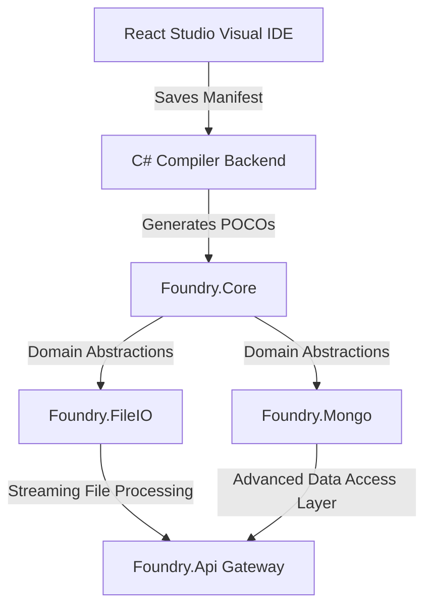

# 🏛️ Foundry Framework Project

Foundry is a high-performance, developer-centric rapid application development framework built on C# (.NET 10) and TypeScript (React 19 + Vite). It features visual domain schema compilation, automatic C# code generation, a robust data access layer (supporting partitioning, OCC, auditing, and security), and a pipeline-validated API service layer.

---

## 🗺️ Project Architecture & Components

The repository is structured into isolated, high-cohesion libraries and applications:



| Component | Directory | Description |
| :--- | :--- | :--- |
| **`Foundry.Core`** | [`foundry-core/`](file:///Users/prajuab/Workspace/foundry/foundry-core/) | Shared domain entity interfaces (`IEntity`, `ISoftDelete`, `IVersionable`), paging wrappers, core model definitions, and shared audit models. |
| **`Foundry.Mongo`** | [`foundry-mongo/`](file:///Users/prajuab/Workspace/foundry/foundry-mongo/) | Advanced MongoDB data access layer (`IRepository`, OCC, dynamic seek pagination, background archival worker, hot/cold partitioned repositories). |
| **`Foundry.FileIO`** | [`foundry-file-io/`](file:///Users/prajuab/Workspace/foundry/foundry-file-io/) | Pluggable file processing library (CSV parser, Excel streaming reader, CSV exporter, file signature validator, and traversal path sanitiser). |
| **`Foundry.Rules`** | [`foundry-rules/`](file:///Users/prajuab/Workspace/foundry/foundry-rules/) | Decoupled, lightweight business rules and policy validation engine (contracts, dynamic rules orchestrator, custom exceptions) for domain-level consistency checks. |
| **`Foundry.Api`** | [`foundry-api/`](file:///Users/prajuab/Workspace/foundry/foundry-api/) | API Gateway with MediatR pipeline behaviors (Security, Caching, Audit, Validation, and multi-stage Business Rules validation). |
| **`Foundry.RealTime`** | [`foundry-realtime/`](file:///Users/prajuab/Workspace/foundry/foundry-realtime/) | Event-streaming and real-time communications broker (SignalR notification hubs, raw WebSockets, Server-Sent Events) integrated transparently at the repository audit sink level. |
| **`Foundry.Schema`** | [`foundry-schema/`](file:///Users/prajuab/Workspace/foundry/foundry-schema/) | Schema Compiler, API Backend Server, and React Studio Visual IDE (featuring light/dark theme toggling, undo/redo state history, navigable minimap, and fit-to-page diagram printing). |

---

## 🚀 Getting Started

### 1. Build and Compile the Entire Solution
To build all projects across the workspace:
```bash
dotnet build
```

### 2. Launch the Studio Designer & Compiler API
Boot both the C# compiler backend service and the React Studio Visual IDE, and launch it in your web browser:
```bash
cd foundry-schema
./start-studio.sh
```

---

## 🔌 Infrastructure & Docker Orchestration

Foundry includes a pre-configured Docker Compose orchestrator stack to boot local development and testing services instantly:

```bash
# Spin up MongoDB, Mongo Express, Kafka, and Kafka UI
docker compose up -d
```

- **MongoDB** (`localhost:27017`): Core transactional and event outbox database.
- **Mongo Express** (`localhost:8081`): Web UI console to inspect document collections.
- **Kafka Broker** (`localhost:9092`): Event streaming messaging platform.
- **Kafka UI** (`localhost:8080`): Visual console to inspect topic logs, partitions, and message payloads.

---

## 🛡️ Enterprise-Grade Architectural Features

The framework is enhanced with enterprise-level security, resiliency, and performance architectures:

1. **Central Package Management (CPM)**: Package versions are governed solution-wide at the root level via `Directory.Packages.props`.
2. **KMS Envelope Encryption**: AES-256 field-level data protection using startup Data Encryption Key (DEK) decryption via a secure KMS client.
3. **Microsoft.RulesEngine Sandboxing**: Execution boundary limits on dynamic query strings inside the rules evaluator to prevent RCE vectors.
4. **MediatR Request Idempotency**: Pipeline behavior deduplicating commands based on unique keys, throwing client conflicts (`409 Conflict`) on duplicate requests.
5. **Transactional Outbox Pattern**: Automatic capture of domain mutation events in MongoDB, with tracing context propagation (Correlation ID and W3C `traceparent` headers) over Kafka message headers.
6. **Active Cluster Health Checks**: Direct metadata queries for Kafka broker and MongoDB database liveness.
7. **Native AOT Route Generation**: Static route generation and compile-time query filter expression builders in `ApiRouteGenerator` to eliminate reflection and support Native AOT.
8. **Commercial Studio UI**: Upgraded React Studio layout featuring Glassmorphic styling, custom Inter typography, fit-to-page visual schema exporter, and local Ollama model options.

---

## 🧪 Running Tests

The test suite covers partitioning logic, soft-delete transactions, caching, file processing, idempotency, envelope encryption, outbox dispatching, and pipeline behaviors.

### Run All Integration & Unit Tests
```bash
dotnet test foundry-integration-tests/Foundry.IntegrationTests.csproj
```
All **75/75** tests are verified passing green.

---

## 📖 Sub-Project Documentation

For details on configuration and APIs in specific layers:
*   [**Data Access Layer (MongoDB) Manual**](file:///Users/prajuab/Workspace/foundry/foundry-mongo/docs/developer_reference.md)
*   [**API & Business Rules validation Manual**](file:///Users/prajuab/Workspace/foundry/foundry-api/docs/developer_reference.md)
*   [**FileIO Processing Library Manual**](file:///Users/prajuab/Workspace/foundry/foundry-file-io/README.md)

---

## 🔀 Workflow & UML State Transition Engine

Foundry integrates a state-of-the-art hybrid workflow transition and sequential DAG orchestration engine:

*   **UML Choice Nodes (Decision Gates)**: Supports dynamic condition-based routing at gate vertices (e.g. `check_amount_choice`). Evaluates property comparisons recursively (with recursion limit guards) to route the entity to the correct target state or fallback (`Else`) destination.
*   **Pipeline Auditing & Historical Logs**: Every transition maps claim validations, security checks, state alterations, and logs actions into `WorkflowActivityLog` documents automatically.
*   **Visual UML Canvas**: Integrated into the React Studio, featuring a full React Flow drag-and-drop canvas supporting node positions save/load, direct click selection, connection draws, and dynamic light/dark theme styling.
