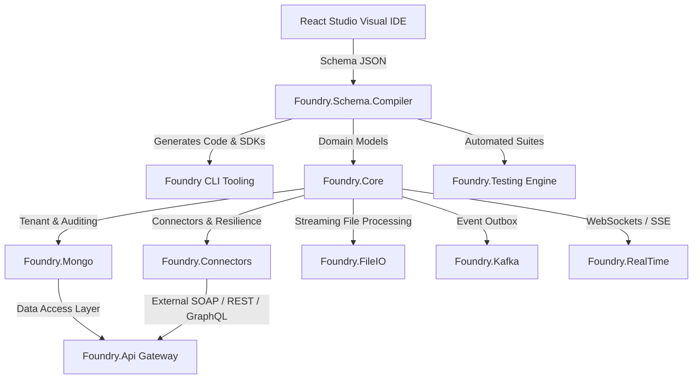

# 🏛️ Foundry Framework Project

Foundry is a high-performance, developer-centric rapid application development framework built on C# (.NET 10) and TypeScript (React 19 + Vite). It features visual domain schema compilation, automatic C# code generation, multi-protocol integration (REST, GraphQL, Kafka, WebSockets, FileIO, Connectors), multi-tenant isolation, native client SDK generation, and an autonomous multi-protocol testing engine.

---

## 🗺️ Project Architecture & Components

The repository is structured into isolated, high-cohesion libraries, tools, and applications:



| Component | Directory | Description |
| :--- | :--- | :--- |
| **`Foundry.Core`** | [`foundry-core/`](foundry-core/) | Shared domain entity interfaces (`IEntity`, `ISoftDelete`, `IMultiTenant`, `IVersionable`), `TenantContext` ambient propagation, and core models. |
| **`Foundry.Mongo`** | [`foundry-mongo/`](foundry-mongo/) | Advanced MongoDB data access layer (`IRepository`, tenant isolation filter injection, OCC, dynamic seek pagination, background archival worker, hot/cold partitioned repositories). |
| **`Foundry.FileIO`** | [`foundry-file-io/`](foundry-file-io/) | Pluggable file processing library (CSV parser, Excel streaming reader, CSV exporter, file signature validator, and path sanitiser). |
| **`Foundry.Rules`** | [`foundry-rules/`](foundry-rules/) | Decoupled, lightweight business rules and policy validation engine (contracts, dynamic rules orchestrator, custom exceptions). |
| **`Foundry.Kafka`** | [`foundry-kafka/`](foundry-kafka/) | Transactional outbox event streaming with trace propagation over Kafka message headers. |
| **`Foundry.RealTime`** | [`foundry-realtime/`](foundry-realtime/) | Event-streaming and real-time communications broker (SignalR notification hubs, WebSockets, SSE) integrated at repository audit sink level. |
| **`Foundry.Connectors`** | [`foundry-connectors/`](foundry-connectors/) | Enterprise external service connectors (REST, SOAP 1.1/1.2, GraphQL) with Polly v8 resilience pipelines, authentication, and health checks. |
| **`Foundry.Testing`** | [`foundry-testing/`](foundry-testing/) | Autonomous multi-protocol testing engine generating schema-driven mock data, xUnit test suites, and interactive HTML execution reports. |
| **`Foundry.Api`** | [`foundry-api/`](foundry-api/) | API Gateway with MediatR pipeline behaviors (Security, Tenant Middleware, Sliding Window Rate Limiting, Caching, Audit, Rules Validation). |
| **`Foundry.Cli`** | [`foundry-cli/`](foundry-cli/) | Unified CLI: `new`, `compile`, `validate`, `export`, `sdk`, `doctor`, `test`, `lsp`, `studio`, `api`, plus the AI toolchain (`ai`, `ai-spec`, `eval`). |
| **`Foundry.Studio`** | [`foundry-studio/`](foundry-studio/) | React 19 + Vite Visual Studio IDE featuring domain modeling, DTO composition, workflow designer, external connector setup, API playground, and autonomous test suite runner. |
| **`foundry-vscode`** | [`foundry-vscode/`](foundry-vscode/) | Native VS Code Extension & LSP Server integration embedding Foundry Studio canvas into editor tabs with native schema sync. |

---

## 🚀 Getting Started

### Prerequisites

- **.NET 10 SDK** — `dotnet --version` should report `10.0.x`
- **Node.js 20+** — required to build the Studio bundle, which the CLI embeds
- **Docker** — the MongoDB and API test suites talk to a real database

### 1. Clone and Build

```bash
git clone https://github.com/prajuaba/foundry.git
cd foundry
```

Build the Studio bundle **before** the solution. `Foundry.Cli` embeds
`foundry-studio/dist/index.html` as a resource, and `dist/` is a build artifact that is
deliberately not committed. Skipping this step is not fatal — the build warns and only the
`foundry studio` command becomes unavailable — but the CLI is incomplete without it:

```bash
cd foundry-studio && npm ci && npm run build && cd ..
```

Then build all 21 projects via the solution file at the repository root:

```bash
dotnet build Foundry.slnx
```

### 2. Run the Test Suites

Start the infrastructure first. The MongoDB and API suites talk to a real database and
**fail rather than skip** without it:

```bash
docker compose up -d
```

Then run the whole solution in one command:

```bash
dotnet test Foundry.slnx
```

Expect **836 C# tests passing**: 228 compiler, 87 rules, 85 integration, 75 API, 75 file-IO,
70 MongoDB, 52 core, 52 connectors, 39 Kafka, 26 real-time, 26 testing, 21 CLI. Run it this way
rather than per-project — a solution-wide run exercises project interactions that
individual runs miss, and it is exactly what CI does.

Studio is TypeScript and has its own suite (33 tests):

```bash
cd foundry-studio && npm test
```

The suites above check that code is generated and that it compiles. Neither says an application
*works*, so one gate scaffolds two projects, runs them, and drives them over HTTP with real JWTs it
mints itself — authentication, the roles a schema declares, row-level ownership, workflow
transitions, CRUD, validation, filtering, optimistic concurrency, a restart, and tenant isolation
across two tenants. It also exports all four specification formats and checks the documented routes
against the server that is running, which is the one form of that claim two components cannot satisfy
by agreeing on the same mistake. It needs MongoDB on `localhost:27017`:

```bash
./scripts/runtime-smoke-test.sh
```

The transactional outbox is proven separately, against a real broker. These tests **fail rather
than skip** without one, so they are excluded from the solution-wide run by category and have
their own command:

```bash
dotnet test foundry-kafka/tests/Foundry.Kafka.IntegrationTests --filter "Category=RequiresKafka"
```

### 3. Calling a Scaffolded API

Generated endpoints **require an authenticated caller**. Roles declared in a schema under
`apiRoles` are enforced on the endpoint; an entity that declares none still requires a valid
token, because "no policy stated" is not the same as "open to anyone".

`foundry new` writes a per-project signing key to `appsettings.Development.json` and gitignores
it. Every other environment must supply its own, and the application **refuses to start**
without one rather than serving unauthenticated traffic:

```bash
# An OIDC provider (Entra ID, Keycloak, Auth0) -- the production shape
export Authentication__Jwt__Authority="https://login.example.com/"
export Authentication__Jwt__Audience="my-api"
```

```bash
# Or a symmetric key, for tokens the system issues itself. At least 32 bytes.
export Authentication__Jwt__SigningKey="$(openssl rand -base64 48)"
```

Roles are read from the `role` claim and the tenant from `tenant_id`; both claim names are
configurable under `Authentication:Jwt`. A signed `tenant_id` always outranks the
`X-Tenant-ID` header, which remains only for callers a token cannot describe.

Roles decide whether a caller may use an endpoint. To decide which **rows** they see through it,
mark an entity owner-scoped:

```json
{
  "name": "Note",
  "ownerScoped": true,
  "ownerExemptRoles": ["Supervisor"],
  "properties": [
    { "name": "OwnerId", "type": "string", "isOwnerKey": true }
  ]
}
```

A workflow declared in a schema becomes a route per transition, `POST
/api/orders/transitions/{trigger}` with `{"entityId": "..."}`. The engine refuses a transition whose
source state does not match with a **409** naming the state the record is actually in, and a
transition's `requiredRoles` are enforced on its endpoint as well as inside the pipeline.

Every transition is recorded, and `GET /api/orders/{id}/history` reads that back: each entry names
the transition, the states it moved between, who triggered it, when, and the outcome of every
automated action. The endpoint loads the record before serving its history, so it is governed by the
same tenant and owner filters as reading the record itself — and by the roles the entity declares for
`GET_BY_ID`, since reading a record's history is a read of that record.

`OwnerId` is assigned from the caller's `sub` claim and overwritten if a request body sets it.
Lists, reads by id, updates and deletes are all narrowed to the caller's own rows; roles in
`ownerExemptRoles` see everything **within their tenant**, never across one. The tenant key must
be named `TenantId` and the owner key `OwnerId` — the data layer filters on those field names, and
the compiler rejects any other name rather than emitting a filter that matches nothing.

### 4. CLI Tooling Commands (`foundry`)
Run the unified `Foundry.Cli` executable:
```bash
# Export multi-spec documentation. The schema is passed with -i, not positionally, and -o
# names the output *file*: these commands take no positional arguments and silently ignore one.
foundry export -i schema.json -f openapi  -o docs/openapi.json
foundry export -i schema.json -f asyncapi -o docs/asyncapi.json
foundry export -i schema.json -f postman  -o docs/postman_collection.json
foundry export -i schema.json -f mermaid  -o docs/schema.mmd

# Generate client SDKs for frontend/backend integration
foundry sdk -i schema.json -l ts -o sdk/
foundry sdk -i schema.json -l cs -o sdk/
foundry sdk -i schema.json -l py -o sdk/

# Run autonomous multi-protocol test suite
foundry test schema.json --output-dir tests/

# Boot visual Studio IDE in browser
foundry studio --port 5100

# Validate a schema; exits non-zero on error, so it works as a CI gate
foundry validate schema.json
```

### 5. AI-Assisted Modelling (Local Models Only)

Foundry's AI toolchain runs against a local [Ollama](https://ollama.com) instance —
no domain model leaves the machine. The model authors **IR**, never C#; the compiler
turns IR into code, so infrastructure concerns (tenancy, encryption, indexing, outbox)
cannot be got wrong by the model, because it does not write that layer.

```bash
# Emit the skill bundle a local model needs: IR JSON Schema, vocabulary,
# diagnostics catalogue and verified golden examples
foundry ai-spec --out .foundry/skill

# Generate a validated IR document from natural language
foundry ai "Model a clinic with multi-tenant patients and an encrypted email" --out schema.json

# Measure how reliably your model authors IR, per construct
foundry eval --runs 3 --difficulty Hard
```

Configure via `FOUNDRY_OLLAMA_HOST` and `FOUNDRY_OLLAMA_MODEL` (defaults:
`http://localhost:11434`, `qwen3-coder:30b`). Generation is grammar-constrained to
the IR schema and validated, with failures fed back to the model for repair.

Measured accuracy for `qwen3-coder:30b`: **100%** on the 30 core cases, **40%** on
the 10 hard cases (business phrasing, buried requirements, multi-entity domains),
with **100% schema-valid output in both bands**.

### 6. VS Code Extension Integration
Build and launch the Studio IDE directly inside VS Code:
```bash
cd foundry-vscode
npm run build:all
```
Double-click any `.foundry.json` or `.foundry` file in VS Code to open the visual Studio canvas!

---

## 🔌 Infrastructure & Docker Orchestration

Foundry includes a pre-configured Docker Compose orchestrator stack:

```bash
# Spin up MongoDB, Mongo Express, Kafka, and Kafka UI
docker compose up -d
```

- **MongoDB** (`localhost:27017`): Core transactional and event outbox database.
- **Mongo Express** (`localhost:8081`): Web UI console to inspect document collections.
- **Kafka Broker** (`localhost:9092`): Event streaming messaging platform.
- **Kafka UI** (`localhost:8080`): Visual console to inspect topic logs and partitions.

---

## 🛡️ Enterprise-Grade Architectural Features

1. **Multi-Tenancy & Data Isolation**: `ITenantContext` and `[TenantKey]` attribute with automatic tenant filter injection at the repository level.
2. **External Service Connectors (`Foundry.Connectors`)**: Built-in REST, SOAP 1.1/1.2, and GraphQL connectors with Polly v8 exponential backoff, circuit breakers, and health checks.
3. **Autonomous Testing Engine (`Foundry.Testing`)**: Automated generation of schema-driven synthetic mock datasets, protocol unit/integration tests, and HTML execution reports.
4. **Multi-Format Specification Exporters**: Standardized exporters for OpenAPI 3.1.0, AsyncAPI 3.0.0, Postman Collection 2.1, and Mermaid class/ERD diagrams.
5. **Language Server Protocol (LSP)**: Integrated LSP server (`foundry lsp`) providing diagnostic linting, autocomplete, and code actions for VS Code.
6. **Central Package Management (CPM)**: Package versions are governed solution-wide at the root level via `Directory.Packages.props`.
7. **Transactional Outbox Pattern**: Automatic capture of domain mutation events in MongoDB, with tracing context propagation (Correlation ID and W3C `traceparent` headers) over Kafka message headers.
8. **Sliding Window Rate Limiting**: Built-in ASP.NET Core sliding window rate limiter per tenant and API endpoint.

---

## 🧪 Testing & Verification

The integration test suite verifies partitioning logic, multi-tenancy, soft-delete transactions, caching, file processing, idempotency, envelope encryption, outbox dispatching, external connectors, and pipeline behaviors.

To run all unit and integration tests (with `docker compose up -d` already running):
```bash
dotnet test Foundry.slnx
```
