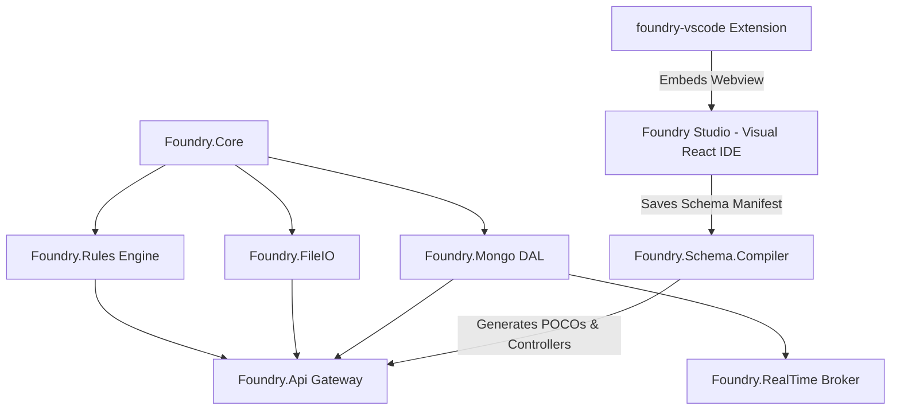

# 📚 Foundry Framework Central Documentation Portal

Welcome to the centralized documentation hub for the **Foundry Framework**. This portal contains all architecture specifications, developer reference guides, quick-start setup instructions, and sub-project documentation.

---

## 🗂️ Documentation Navigation Index

### 🚀 [1. Getting Started](getting-started/quick-start-guide.md)
* [Quick Start Guide](getting-started/quick-start-guide.md) — Local environment setup, running the E2E showcase, running Foundry Studio IDE, and VS Code extension installation.

### 🏛️ [2. Architecture & Design](architecture/master-architecture-spec.md)
* [Master Architecture Specification](architecture/master-architecture-spec.md) — System layer topology, data flow, KMS envelope encryption, transactional outbox pattern, MediatR pipeline behaviors, and workflow state engines.

### 🧩 [3. Module Documentation](modules/)
* [Foundry Studio IDE](modules/foundry-studio.md) — Standalone React 19 visual canvas for class diagrams, DTOs, custom endpoints, and UML workflows.
* [Foundry VS Code Extension](modules/foundry-vscode.md) — Custom editor provider and compiler bridge for VS Code.
* [Foundry Schema Compiler](modules/foundry-schema.md) — AST compiler, code generator, and POCO generation.
* [Foundry Mongo DAL](modules/foundry-mongo.md) — Advanced MongoDB repository layer, OCC, seeking pagination, and migration runner.
* [Foundry API Engine](modules/foundry-api.md) — Endpoint generation, MediatR pipeline, RBAC, caching, and health checks.

### 📖 [4. API Reference](reference/developer-reference.md)
* [Repository Decomposition Plan](reference/repository-decomposition.md) — the four-step plan for `Repository<T>`, with step 1 stage one done and the exact seam for stage two.
* [Developer Reference](reference/developer-reference.md) — Every public function, type and CLI command in one place: the IR schema language and its attribute vocabulary, the compiler API, the generated HTTP contract, and the full surface of all nine runtime libraries.

### 🔎 [5. Project Status](engineering-assessment.md)
* [Engineering Assessment (2026-07-26)](engineering-assessment.md) — Candid read of current maturity: measured AI/IR accuracy, the silent-failure defect class, test-coverage reality, and the prioritised case for verification over features.

---

## 🛠️ Repository Architecture Map

---

## ⚡ Quick Links
* **Repository Root README**: [README.md](../README.md)
* **Sample Showcase App**: [samples/Foundry.E2E.Showcase](../samples/Foundry.E2E.Showcase/)
* **Integration Tests**: [foundry-integration-tests](../foundry-integration-tests/)
