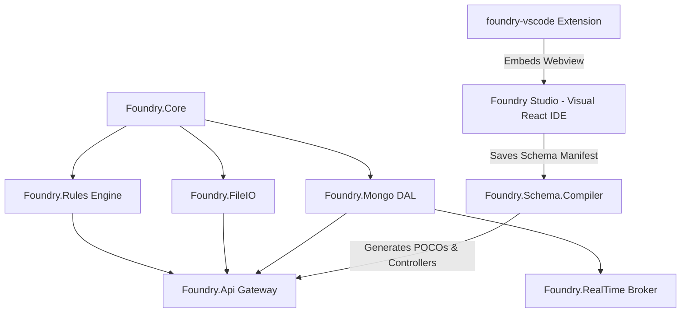

# 📚 Foundry Framework Central Documentation Portal

Welcome to the centralized documentation hub for the **Foundry Framework**. This portal contains all architecture specifications, developer reference guides, quick-start setup instructions, and sub-project documentation.

---

## 🗂️ Documentation Navigation Index

### 🚀 [1. Getting Started](file:///Users/prajuab/Workspace/foundry/docs/getting-started/quick-start-guide.md)
* [Quick Start Guide](file:///Users/prajuab/Workspace/foundry/docs/getting-started/quick-start-guide.md) — Local environment setup, running the E2E showcase, running Foundry Studio IDE, and VS Code extension installation.

### 🏛️ [2. Architecture & Design](file:///Users/prajuab/Workspace/foundry/docs/architecture/master-architecture-spec.md)
* [Master Architecture Specification](file:///Users/prajuab/Workspace/foundry/docs/architecture/master-architecture-spec.md) — System layer topology, data flow, KMS envelope encryption, transactional outbox pattern, MediatR pipeline behaviors, and workflow state engines.

### 🧩 [3. Module Documentation](file:///Users/prajuab/Workspace/foundry/docs/modules/)
* [Foundry Studio IDE](file:///Users/prajuab/Workspace/foundry/docs/modules/foundry-studio.md) — Standalone React 19 visual canvas for class diagrams, DTOs, custom endpoints, and UML workflows.
* [Foundry VS Code Extension](file:///Users/prajuab/Workspace/foundry/docs/modules/foundry-vscode.md) — Custom editor provider and compiler bridge for VS Code.
* [Foundry Schema Compiler](file:///Users/prajuab/Workspace/foundry/docs/modules/foundry-schema.md) — AST compiler, code generator, and POCO generation.
* [Foundry Mongo DAL](file:///Users/prajuab/Workspace/foundry/docs/modules/foundry-mongo.md) — Advanced MongoDB repository layer, OCC, seeking pagination, and migration runner.
* [Foundry API Engine](file:///Users/prajuab/Workspace/foundry/docs/modules/foundry-api.md) — Endpoint generation, MediatR pipeline, RBAC, caching, and health checks.

---

## 🛠️ Repository Architecture Map

---

## ⚡ Quick Links
* **Repository Root README**: [README.md](file:///Users/prajuab/Workspace/foundry/README.md)
* **Sample Showcase App**: [samples/Foundry.E2E.Showcase](file:///Users/prajuab/Workspace/foundry/samples/Foundry.E2E.Showcase/)
* **Integration Tests**: [foundry-integration-tests](file:///Users/prajuab/Workspace/foundry/foundry-integration-tests/)
