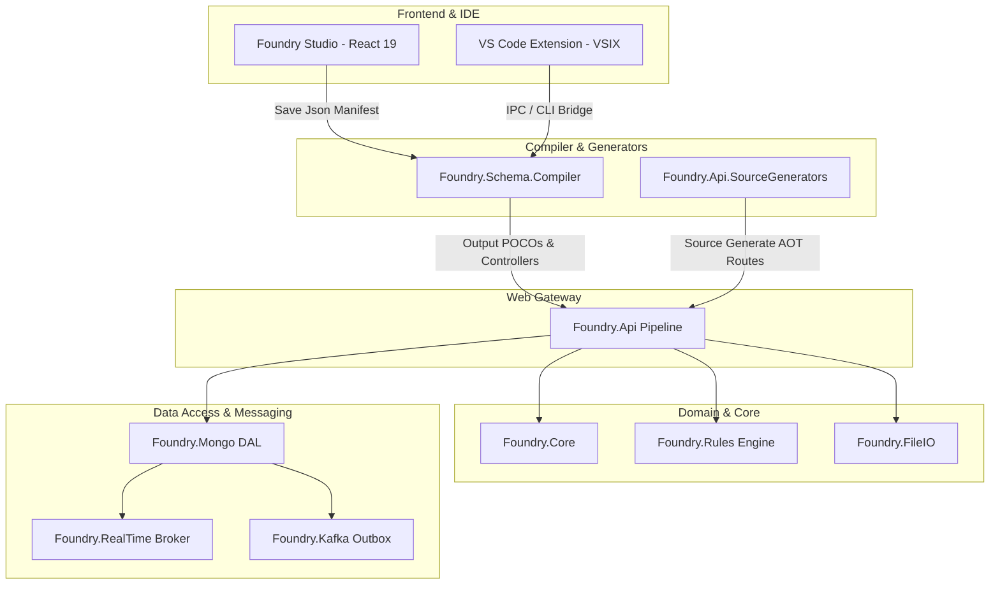

# 🏛️ Foundry Master Architecture & Functional Specification

This document provides an exhaustive reference of the architecture, security patterns, data access mechanisms, and pipeline validation engines across the **Foundry Framework**.

---

## 🗺️ System Layer Topology

---

## 🛡️ Enterprise Architectural Specifications

### 1. KMS Envelope Encryption Architecture
Foundry.Mongo implements field-level Encryption (`[Encrypt]`, `[Mask]`, `[MaskEmail]`):
* **DEK (Data Encryption Key)**: Decrypted at startup via a secure KMS client.
* **AES-256-GCM**: Symmetric authenticated encryption for sensitive properties.
* **Masking**: Irreversible email/string masking (`j***@domain.com`) for logs and UI rendering.

### 2. Transactional Outbox Pattern & Tracing
* **MongoDB Outbox Collection**: Automatic capture of domain events in the same MongoDB ACID transaction.
* **W3C Trace Context**: Tracing context (`traceparent`, `CorrelationId`) propagated over Kafka headers for cross-service distributed telemetry.

### 3. MediatR Idempotency & Conflict Resolution
* **Command Deduplication**: Inbound API commands are deduplicated by idempotent request keys.
* **Conflict Handling**: Duplicate requests throw `ClientConflictException` mapped to HTTP `409 Conflict`.

### 4. UML State Machine & Choice Node Engine
* **Decision Gates**: Supports dynamic condition evaluation at choice node vertices (`check_amount_choice`).
* **Recursion Guard**: Circuit breaker guarding against cyclic transition loops.
* **Audit Trail**: Every state transition emits a `WorkflowActivityLog` document.
