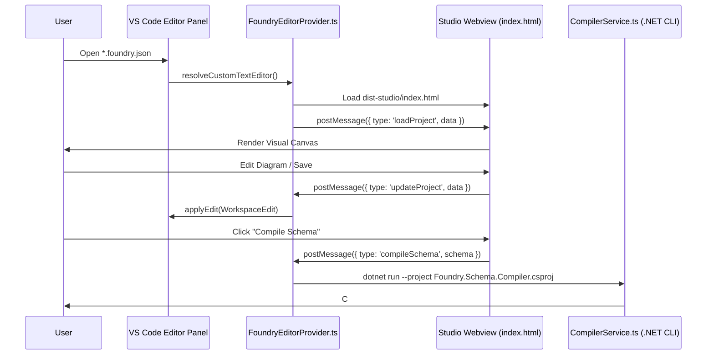

# 🔌 Foundry VS Code Extension Module Documentation

**foundry-vscode** is a native Visual Studio Code Extension (`foundry-vscode-1.0.0.vsix`) providing a custom editor provider for `.foundry.json` manifest files inside VS Code.

---

## 💡 Architecture & IPC Protocol



---

## 📁 Directory Location

```text
foundry-vscode/
├── src/
│   ├── extension.ts              # Extension activation & command registration
│   ├── FoundryEditorProvider.ts  # Custom Editor Provider serving Webview
│   └── CompilerService.ts        # Service invoking C# Compiler backend
├── scripts/
│   └── verify-extension.js       # Automated VSIX extension test suite
├── package.json
└── esbuild.js                    # Esbuild Extension Bundler
```

---

## ⚙️ Packaging & Verification Commands

```bash
cd foundry-vscode

# Build studio singlefile, copy assets, and bundle extension
npm run build:all

# Package .vsix installer package
npm run package

# Run automated verification suite
node scripts/verify-extension.js
```
